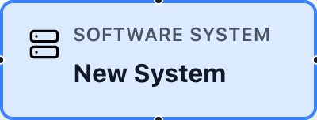
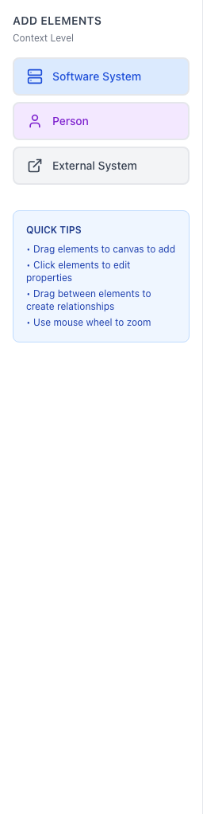
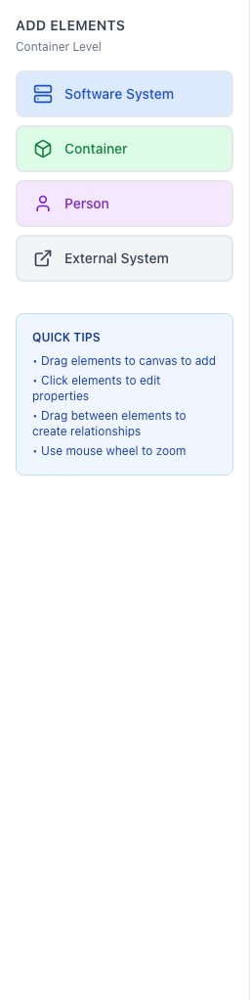
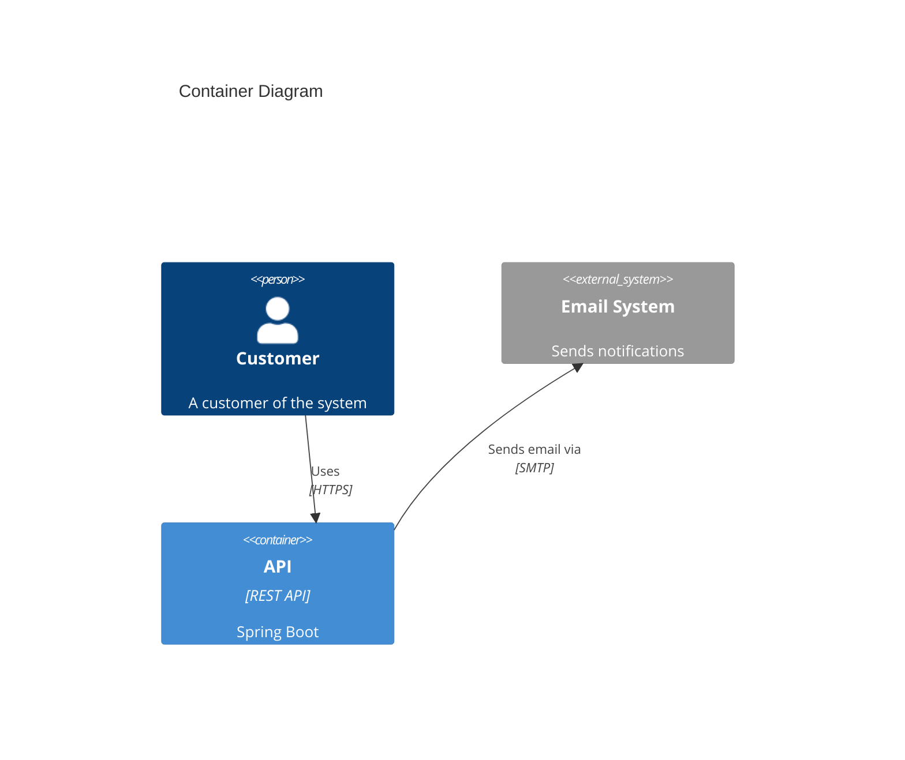
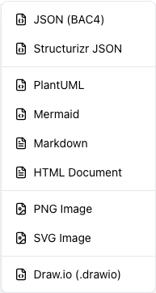
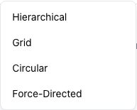
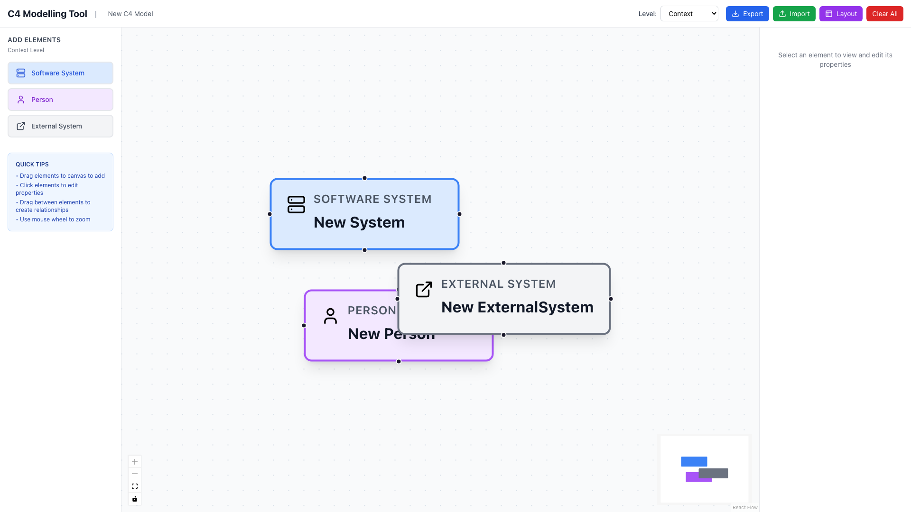

# BAC4 Standalone: Interactive C4 Modelling for Solution Architects

*A browser-based, zero-install tool for creating and maintaining C4 architecture diagrams with visual drag-and-drop editing*

---

## The Challenge: Documentation That Stays Current

As solution architects, we face a constant dilemma: architecture documentation needs to be both comprehensive and maintainable. The C4 model, introduced by Simon Brown, has become the de facto standard for documenting software architecture through its clear hierarchical approach (Context, Container, Component, Code). However, existing tools present trade-offs:

- **PlantUML/C4-PlantUML**: Excellent for version control and code review, but requires learning DSL syntax and involves a render-preview cycle that slows iterative design
- **Draw.io/Lucidchart**: Visual and intuitive, but diagrams become disconnected from structured data, making them difficult to maintain or programmatically validate
- **Enterprise tools**: Feature-rich but require installation, licensing, training, and ongoing maintenance

What if we could combine the best of both worlds: the visual immediacy of drag-and-drop tools with the structured data approach of text-based formats?

## Introducing BAC4 Standalone

BAC4 Standalone is an interactive C4 modelling tool that runs entirely in your browser as a single HTML file. No server, no installation, no dependencies—just open it and start designing.


*The BAC4 interface: toolbar on the left, canvas in the center, and properties panel on the right*

### What Makes It Different

**1. True Standalone Architecture**
- Single 450KB HTML file containing everything
- Works completely offline
- No cloud services, no data transmission
- Distribute via email, USB, or intranet

**2. Visual-First, Data-Aware Design**
- Drag-and-drop interface for rapid prototyping
- Structured data model underneath
- Export to 7 formats including PlantUML, Mermaid, and JSON
- Properties panel for detailed element metadata

**3. Zero Learning Curve**
- If you understand C4, you understand the tool
- Context-aware toolbar shows only relevant element types
- Auto-switching between abstraction levels
- Intelligent auto-layout algorithms

### C4 Element Types

BAC4 supports all standard C4 element types with distinct visual styling:

| Software System | Person | External System | Container | Component |
|:---------------:|:------:|:---------------:|:---------:|:---------:|
|  |  |  |  |  |
| *Blue* | *Purple* | *Gray* | *Green* | *Yellow* |

**4. Architecture-Focused Features**
- Level-aware element visibility (Context → Container → Component → Code)
- Relationship customization (arrow direction, line styles, protocols)
- Tags for categorization and filtering
- Auto-save with localStorage persistence

## How It Works: Technical Architecture

### Component Overview


*BAC4's internal architecture: UI components connect through a central Zustand store to utilities*

### State Management

We use Zustand for lightweight, predictable state management:

```javascript
// Separate arrays for each C4 element type
{
  systems: [],
  containers: [],
  components: [],
  people: [],
  externalSystems: [],
  relationships: [],
  currentLevel: 'context',
  selectedElement: null
}
```

Key decision: Individual array subscriptions prevent re-render cascades while maintaining reactivity.

### Level-Aware Filtering

The tool enforces C4 level semantics:

| Level | Visible Elements |
|-------|-----------------|
| **Context** | Systems, People, External Systems |
| **Container** | Systems, Containers, People, External Systems |
| **Component** | Containers, Components, People |
| **Code** | Components only |

When you add an element, the system automatically switches to an appropriate level for visibility. The toolbar dynamically shows only relevant element types for your current level.

| Context Level | Container Level | Component Level |
|:-------------:|:---------------:|:---------------:|
|  |  |  |
| *Systems, People, External Systems* | *+ Containers* | *Containers, Components, People* |

### Export Pipeline

Each export format follows a consistent pipeline:

```
Model (Zustand) → Transform → Format → Download
```

**JSON Export**: Direct serialization of the model state—ideal for backup and import.

**PlantUML Export**: Transforms model into C4-PlantUML syntax:
```plantuml
@startuml
!include https://raw.githubusercontent.com/.../C4_Container.puml

Person(user, "Customer", "A customer of the system")
System_Ext(email, "Email System", "Sends notifications")
Container(api, "API", "REST API", "Spring Boot")

Rel(user, api, "Uses", "HTTPS")
Rel(api, email, "Sends email via", "SMTP")
@enduml
```

**Mermaid Export**: Modern alternative with native GitHub/GitLab support:


**Markdown Export**: Structured documentation with tables—perfect for Confluence, wikis, or README files.

**HTML Export**: Self-contained document with metadata, element tables, relationships, and embedded PlantUML code.

**PNG/SVG Export**: Visual snapshots using html-to-image library for presentations and documentation.


*Seven export formats available from the Export dropdown*

### Auto-Layout Algorithms

Four layout algorithms handle different scenarios:

1. **Hierarchical**: Layer-based layout respecting C4 hierarchy (Person → System → Container → Component)
2. **Grid**: Uniform spacing for simple, organized diagrams
3. **Circular**: Emphasizes connections and communication patterns
4. **Force-Directed**: Physics simulation minimizing overlap—best for organic, relationship-heavy diagrams


*Auto-layout options for organizing your diagram*

## Use Cases for Solution Architects

### 1. Workshop Facilitation

**Scenario**: Architecture design workshop with stakeholders who don't know PlantUML syntax.

**Approach**:
- Open BAC4 in presentation mode
- Drag elements as stakeholders describe the system
- Immediately visualize relationships
- Export to PlantUML/Mermaid for version control post-workshop

**Benefit**: Visual collaboration without syntax barriers, with structured output for documentation.

---

### 2. Rapid Prototyping

**Scenario**: Exploring multiple architectural options during solution design.

**Approach**:
- Quickly sketch Context diagram for Option A
- Export JSON
- Clear canvas, sketch Option B
- Export JSON
- Compare side-by-side in review

**Benefit**: Iterate rapidly without file management overhead or tool complexity.

---

### 3. Legacy System Documentation

**Scenario**: Documenting an undocumented system for modernization planning.

**Approach**:
- Start with Context diagram (external systems, users)
- Drill down to Container level (databases, services, queues)
- Add Component level details for critical areas
- Export to Markdown for wiki, PNG for presentations

**Benefit**: Progressive refinement from high-level to detailed views, with outputs for different audiences.

---

### 4. Stakeholder Communication

**Scenario**: Presenting architecture to non-technical executives and product owners.

**Approach**:
- Create Context diagram showing business systems
- Use descriptive names and minimal technical jargon
- Export as PNG for presentation slides
- Include Markdown documentation as appendix

**Benefit**: Clean, professional diagrams focused on business context, not implementation.

---

### 5. Technical Design Reviews

**Scenario**: Architecture review meeting with engineering teams.

**Approach**:
- Work through Component diagram interactively
- Discuss relationship directions and protocols
- Document decisions with tags and descriptions
- Export to PlantUML for commit to repository
- Export JSON as backup/source of truth

**Benefit**: Interactive discussion with immediate diagram updates, plus version-controllable artifacts.

---

### 6. Documentation As Code Workflows

**Scenario**: Maintaining architecture docs in sync with code changes.

**Approach**:
- Store JSON model in repository alongside code
- Import JSON when architecture changes needed
- Update diagram visually
- Export to PlantUML/Mermaid
- Commit both JSON and generated code
- CI pipeline renders diagrams in documentation

**Benefit**: Visual editing tool integrated with docs-as-code practices.

---

## Comparison with Alternatives

### vs. C4-PlantUML

| Aspect | BAC4 Standalone | C4-PlantUML |
|--------|-----------------|-------------|
| **Editing** | Visual drag-and-drop | Text DSL |
| **Preview** | Immediate | Requires rendering |
| **Learning Curve** | Intuitive (5 min) | Syntax learning (1-2 hours) |
| **Version Control** | Via JSON export | Native (text files) |
| **Workshop Use** | Excellent (no syntax) | Challenging (syntax barrier) |
| **Automation** | Limited | Excellent (text manipulation) |
| **Relationship Styling** | Full control (arrows, lines) | Limited options |
| **Best For** | Rapid design, workshops | CI/CD, docs-as-code |

**Recommendation**: Use BAC4 for design and workshops, export to PlantUML for version control.

---

### vs. Draw.io / Lucidchart

| Aspect | BAC4 Standalone | Visual Tools |
|--------|-----------------|--------------|
| **C4 Awareness** | Built-in levels, semantics | Manual (no validation) |
| **Data Model** | Structured (JSON export) | Visual only |
| **Installation** | None (single HTML file) | Desktop app or web account |
| **Offline** | 100% offline | Varies (often requires account) |
| **Export Formats** | 7 (including PlantUML/Mermaid) | PDF, PNG, SVG |
| **Learning Curve** | Low | Low-Medium |
| **Best For** | C4-specific workflows | General diagramming |

**Recommendation**: Use BAC4 for C4 models; general tools for other diagram types.

---

### vs. Enterprise Architecture Tools (Sparx EA, Archi, etc.)

| Aspect | BAC4 Standalone | Enterprise Tools |
|--------|-----------------|------------------|
| **Scope** | C4 diagrams only | Full EA frameworks |
| **Installation** | None | Significant (licensing, training) |
| **Cost** | Free (MIT license) | $$$-$$$$$ |
| **Collaboration** | File-based (JSON) | Database-backed |
| **Complexity** | Minimal | High |
| **Best For** | Lightweight C4 needs | Enterprise-wide EA governance |

**Recommendation**: Use BAC4 for team-level architecture docs; enterprise tools for organization-wide EA.

---

## Getting Started: A Practical Example

Let's model a simple e-commerce system:

### Step 1: Context Diagram

1. Open `bac4-standalone.html`
2. Level selector shows "Context"
3. Add elements:
   - Person: "Customer"
   - System: "E-Commerce Platform"
   - External System: "Payment Gateway"
   - External System: "Email Service"
4. Create relationships:
   - Customer → E-Commerce Platform: "Browses products, places orders"
   - E-Commerce Platform → Payment Gateway: "Processes payments via REST API"
   - E-Commerce Platform → Email Service: "Sends order confirmations via SMTP"

**Result**: High-level system context in under 2 minutes.


*A context diagram with connected elements*

---

### Step 2: Container Diagram

1. Switch level to "Container"
2. Add containers:
   - Container: "Web Application" (React)
   - Container: "API Gateway" (Spring Boot)
   - Container: "Order Service" (Node.js)
   - Container: "PostgreSQL Database"
   - Container: "Redis Cache"
3. Create relationships:
   - Web App → API Gateway: "Makes API calls" (HTTPS)
   - API Gateway → Order Service: "Routes requests" (gRPC)
   - Order Service → PostgreSQL: "Reads/writes" (SQL)
   - Order Service → Redis: "Caches data" (Redis Protocol)

**Result**: Detailed container breakdown showing technology choices.

---

### Step 3: Export and Document

1. **Export JSON**: Backup of your work
2. **Export PlantUML**: For version control in repository
3. **Export Mermaid**: For GitHub README or wiki
4. **Export Markdown**: For Confluence documentation
5. **Export PNG**: For architecture presentation deck

**Result**: 5 deliverables from a single model in 30 seconds.

---

## Best Practices for Solution Architects

### 1. Start Broad, Refine Progressively

Begin with Context diagrams before diving into Containers. Validate high-level understanding with stakeholders before adding detail.

### 2. Use Tags for Governance

Tag elements with:
- **Status**: `legacy`, `new`, `deprecated`, `planned`
- **Domain**: `payment`, `inventory`, `fulfillment`
- **Criticality**: `critical`, `important`, `standard`

(Note: Tags are stored in metadata but not currently visualized—useful for exports and future filtering)

### 3. Leverage Multiple Export Formats

- **JSON**: Primary source of truth (commit to repository)
- **PlantUML/Mermaid**: For docs-as-code workflows
- **PNG**: For presentations and slide decks
- **Markdown**: For wikis and internal documentation

### 4. Combine with Text-Based Tools

BAC4 excels at visual design and rapid iteration. For:
- CI/CD integration
- Automated diagram generation
- Large-scale diagram management

...export to PlantUML and use text-based workflows.

### 5. Document Relationships Thoroughly

Don't just draw lines—add:
- **Description**: "Sends order events to" (not just "uses")
- **Technology**: "Kafka with Avro serialization"
- **Arrow Direction**: Shows data flow direction
- **Line Style**: Dashed for async, solid for sync

This metadata enriches exports and clarifies communication patterns.


*The properties panel for editing element details*

### 6. Use Auto-Layout as a Starting Point

Start with Hierarchical layout, then manually adjust:
- Move critical elements to prominent positions
- Group related elements visually
- Adjust spacing for clarity

Manual refinement after auto-layout gives professional results quickly.

---

## Technical Considerations

### Security

- **No data transmission**: Everything runs client-side
- **No external dependencies**: All assets inlined
- **Safe distribution**: Single HTML file with no executable code beyond standard JavaScript

### Browser Compatibility

- Chrome/Edge: Full support
- Firefox: Full support
- Safari: Full support
- Mobile browsers: Limited (desktop-optimized interface)

### Performance

- Tested up to 50 elements without lag
- React Flow handles canvas rendering
- Auto-save throttled to prevent performance impact
- Layout algorithms optimized for typical C4 diagram sizes


*Built-in zoom controls and minimap for easy navigation*

### Data Persistence

- **localStorage**: Auto-saves every 30 seconds + on page close
- **Quota**: ~5MB typical limit (sufficient for hundreds of diagrams)
- **Backup**: Export JSON regularly to avoid localStorage quota issues

---

## Integration with Existing Workflows

### Confluence Integration

1. Create diagrams in BAC4
2. Export as PNG for visual embedding
3. Export as Markdown for tabular documentation
4. Attach JSON file for future editing

### GitHub/GitLab Integration

1. Store JSON models in `docs/architecture/` directory
2. Export to Mermaid (`.mmd` files)
3. Embed Mermaid in README files (native rendering)
4. Add PNG exports to `docs/images/` for offline viewing

### ADR (Architecture Decision Records) Integration

Include exports in ADR documents:

```markdown
# ADR-005: Microservices Architecture

## Context
We need to scale independently and support polyglot development.

## Decision
Adopt microservices architecture with event-driven communication.

## Architecture

### Container Diagram


### Detailed Documentation
[See full architecture model](./exports/model.json)

### PlantUML Source
[See PlantUML](./exports/container-diagram.puml)
```

---

## Roadmap and Future Enhancements

While BAC4 Standalone is feature-complete for v1.0, potential future enhancements include:

- **Tag filtering**: Show/hide elements by tag
- **Perspective views**: Filter by domain or status
- **Batch element editing**: Update multiple elements simultaneously
- **Style presets**: Custom color schemes and branding
- **Collaboration features**: Conflict resolution for concurrent editing
- **Import from PlantUML/Mermaid**: Bidirectional conversion
- **Model validation**: Check for disconnected elements, naming conventions
- **History/Undo**: Multi-level undo/redo functionality

Community contributions welcome!

---

## Conclusion

BAC4 Standalone bridges the gap between visual diagramming tools and structured, text-based formats. For solution architects, it offers:

✅ **Speed**: Visual editing without syntax barriers
✅ **Structure**: Proper data model with rich exports
✅ **Portability**: Single file, zero dependencies
✅ **Flexibility**: 7 export formats for any workflow
✅ **Simplicity**: No installation, no learning curve

Whether you're facilitating workshops, documenting legacy systems, or maintaining architecture documentation, BAC4 provides an intuitive, lightweight tool that fits into existing workflows without adding complexity.

---

## Getting Started Today

1. **Download**: Get `bac4-standalone.html` from the repository
2. **Open**: Double-click to open in any browser
3. **Create**: Start with a Context diagram
4. **Export**: Generate PlantUML, Mermaid, or PNG
5. **Integrate**: Add to your documentation workflow


*The header bar with title editing, level selector, and action buttons*

No installation. No configuration. No complexity.

Just open and create.

---

## Resources

- **Repository**: [github.com/your-repo/bac4-standalone](https://github.com)
- **C4 Model**: [c4model.com](https://c4model.com)
- **React Flow**: [reactflow.dev](https://reactflow.dev)
- **PlantUML C4**: [github.com/plantuml-stdlib/C4-PlantUML](https://github.com/plantuml-stdlib/C4-PlantUML)
- **Mermaid C4**: [mermaid.js.org/syntax/c4.html](https://mermaid.js.org/syntax/c4.html)

---

*BAC4 Standalone is open source (MIT License). Contributions, feedback, and suggestions are welcome.*

**Built for solution architects, by developers who understand the importance of maintainable architecture documentation.**
