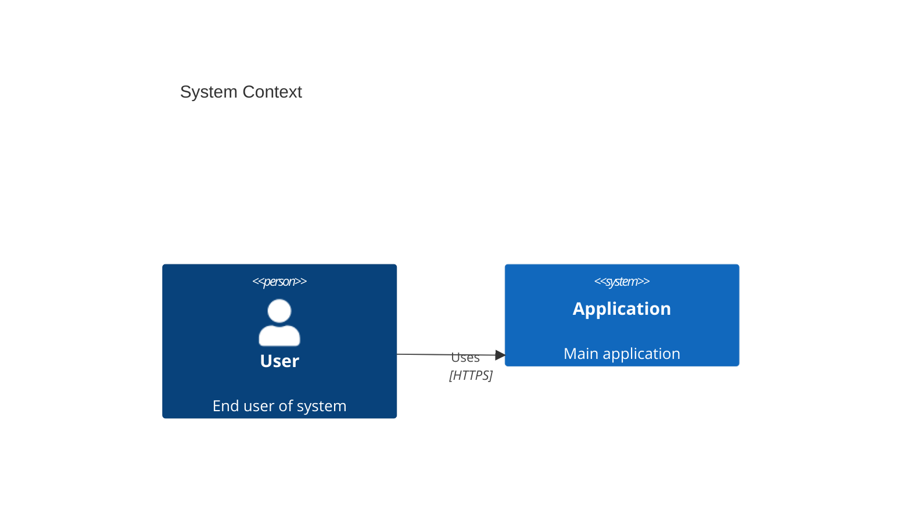

# BAC4 Standalone - Interactive C4 Modelling Tool

An interactive web-based C4 modelling tool built with React that allows architects to create, edit, and visualise C4 diagrams with full interactivity. **Runs completely standalone in any browser - no server, no installation, no dependencies!**

## 🚀 Quick Start

**Ready to use immediately:**

1. Download or build `bac4-standalone.html`
2. Double-click to open it in any browser
3. Start creating C4 diagrams!

**That's it!** The ~477KB file contains everything you need and works entirely offline.

---

## Features

### Core Functionality

- **Interactive Canvas**: Drag-and-drop interface for adding and positioning elements
- **Pan and Zoom**: Navigate large diagrams easily with mouse controls
- **Visual Distinction**: Different colours and icons for each element type
- **Connection Lines**: Auto-routing relationship lines between elements
- **Click-to-Edit**: Click any element to edit its properties inline
- **Level-Aware Toolbar**: Shows only relevant element types for current C4 level

### C4 Level Support

- **Context Level**: Shows systems, people, and external systems
- **Container Level**: Shows systems, containers, people, and external systems
- **Component Level**: Shows containers, components, and people
- **Code Level**: Shows components only
- Automatic level switching when adding elements to ensure visibility
- Level selector in header for manual navigation

### Element Management

- **Add Elements**: Toolbar shows context-appropriate buttons:
  - 🟦 Software System
  - 🟢 Container
  - 🟨 Component
  - 🟣 Person
  - ⚪ External System
- **Edit Properties**: Name, description, technology, tags, position
- **Create Relationships**: Drag between elements to create connections
- **Delete Elements**: With confirmation dialogue (auto-removes orphaned relationships)

### Model Persistence

- **Export Formats**:
  - JSON (full model data)
  - Structurizr JSON (workspace format)
  - PlantUML C4 syntax
  - Mermaid C4 syntax
  - Markdown documentation
  - HTML standalone document
  - PNG image
  - SVG image
  - Draw.io (.drawio) for diagrams.net
- **Import**: Load previously exported JSON models (BAC4 or Structurizr format)
- **Local Storage Auto-save**: Automatically saves every 30 seconds + on page close

### Auto-Layout

Four intelligent layout algorithms:
- **Hierarchical**: Arranges elements in layers by type (best for C4 hierarchy)
- **Grid**: Organises elements in a uniform grid
- **Circular**: Arranges elements in a circle (best for showing connections)
- **Force-Directed**: Physics simulation to minimise overlap

### Relationship Customisation

- **Arrow Direction**: Left (←), Right (→), Both (↔), None (—)
- **Line Style**: Solid, Dashed, Dotted
- **Description**: Custom text for each relationship
- **Technology/Protocol**: Document communication methods (REST, gRPC, etc.)

---

## Building from Source

### Prerequisites

- Node.js 18+
- npm or yarn

### Build Instructions

```bash
# Clone the repository
git clone <repository-url>
cd bac4-standalone

# Install dependencies
npm install

# Build the standalone HTML file
npm run build:standalone
```

The standalone file `bac4-standalone.html` will be created in the root directory.

---

## Usage Guide

### Adding Elements

1. **Check Current Level**: Look at the toolbar - it shows "Context Level", "Container Level", etc.
2. **Click Element Button**: Choose from available element types (toolbar shows only relevant options)
3. **Element Appears**: Added to canvas and level auto-switches if needed
4. **Position Element**: Drag to desired location

### Creating Relationships

1. **Hover Over Element**: Connection handles appear on all sides
2. **Click and Drag**: From one element's handle to another element
3. **Release**: Relationship arrow appears with default description
4. **Edit Relationship**: Click the arrow to modify description/technology

### Editing Properties

1. **Click Element**: Right panel shows properties
2. **Edit Fields**: Name, technology, description, tags
3. **Auto-save**: Changes save automatically when you tab out
4. **Delete**: Use delete button with confirmation

### Arranging Your Diagram

**Manual:**
- Drag elements to position them precisely
- Position info shows in the properties panel

**Automatic:**
- Click "Layout" in the header
- Choose algorithm:
  - Hierarchical (recommended for C4)
  - Grid (for uniform spacing)
  - Circular (for relationship emphasis)
  - Force-Directed (for organic layout)

### Exporting Your Work

1. **Click "Export"** in header
2. **Choose Format**:
   - **JSON (BAC4)**: Save your work to re-import later
   - **Structurizr JSON**: Export to Structurizr workspace format
   - **PlantUML**: Generate C4-PlantUML code
   - **Mermaid**: Generate Mermaid C4 diagram syntax
   - **Markdown**: Create documentation
   - **HTML**: Standalone document with embedded model
   - **PNG**: Raster image for presentations
   - **SVG**: Vector image for scaling
   - **Draw.io**: Open in diagrams.net for further editing
3. **File Downloads**: Automatically with descriptive name

### Working with Levels

The C4 model has 4 abstraction levels. Use the dropdown in the header to switch:

| Level | Purpose | Shows |
|-------|---------|-------|
| **Context** | System landscape | Systems, People, External Systems |
| **Container** | System decomposition | + Containers |
| **Component** | Container internals | Containers, Components, People |
| **Code** | Implementation detail | Components only |

**Tip:** The toolbar automatically shows only relevant element types for your current level!

---

## Keyboard Shortcuts

| Action | Shortcut |
|--------|----------|
| Zoom in/out | Mouse Wheel |
| Pan view | Click + Drag Canvas |
| Select element | Click Element |
| Deselect all | Click Canvas |
| Move element | Drag Element |
| Create relationship | Drag from Connection Handle |

---

## Project Structure

```
bac4-standalone/
├── bac4-standalone.html         # ⭐ THE STANDALONE FILE (all you need!)
├── build-standalone.js          # Build script to create standalone HTML
├── src/
│   ├── components/
│   │   ├── C4Node.jsx          # Custom node rendering
│   │   ├── Header.jsx           # Top navigation with export/import/layout
│   │   ├── Toolbar.jsx          # Level-aware sidebar with element buttons
│   │   └── PropertiesPanel.jsx  # Right sidebar for editing properties
│   ├── hooks/
│   │   └── useLocalStorage.js   # Auto-save hook (30s interval)
│   ├── utils/
│   │   ├── exportUtils.js       # 9 export formats (JSON, PlantUML, Mermaid, etc.)
│   │   ├── structurizrUtils.js  # Structurizr JSON import/export
│   │   └── layoutUtils.js       # 4 auto-layout algorithms
│   ├── store.js                 # Zustand state management
│   ├── App.jsx                  # Main application with React Flow
│   └── main.jsx                 # Entry point
├── package.json
├── vite.config.js
└── README.md
```

---

## Technology Stack

- **React 19**: Modern UI framework with concurrent features
- **React Flow 12**: Interactive node-based diagrams
- **Zustand 4**: Lightweight state management
- **Tailwind CSS 3**: Utility-first styling
- **Lucide React**: Beautiful icon set
- **html-to-image**: Canvas-to-image export
- **file-saver**: Client-side file downloads
- **Vite 7**: Lightning-fast build tool

---

## Data Model

### Model Structure

```json
{
  "metadata": {
    "name": "Project Name",
    "version": "1.0",
    "author": "Author Name"
  },
  "systems": [...],
  "containers": [...],
  "components": [...],
  "people": [...],
  "externalSystems": [...],
  "relationships": [...]
}
```

### Element Structure

```json
{
  "id": "system-1234567890-abc123def",
  "type": "system|container|component|person|externalSystem",
  "name": "Element Name",
  "description": "What this element does",
  "technology": "Spring Boot, PostgreSQL",
  "tags": ["backend", "core"],
  "position": { "x": 350, "y": 200 }
}
```

### Relationship Structure

```json
{
  "id": "rel-1234567890-abc123def",
  "from": "source-element-id",
  "to": "target-element-id",
  "description": "Makes API calls to",
  "technology": "REST/HTTPS",
  "arrowDirection": "right",
  "lineStyle": "solid",
  "animated": false
}
```

---

## Export Format Details

### JSON
Full model data that can be re-imported. Use this to save your work!

### PlantUML
C4-PlantUML syntax compatible with PlantUML rendering tools:
```plantuml
@startuml
!include https://raw.githubusercontent.com/.../C4_Context.puml

Person(user, "User", "End user of system")
System(app, "Application", "Main application")
Rel(user, app, "Uses", "HTTPS")
@enduml
```

### Mermaid
Mermaid C4 diagram syntax compatible with Mermaid rendering tools (GitHub, GitLab, Confluence):


### Markdown
Structured documentation with tables, suitable for wikis, GitHub, or README files.

### HTML
Self-contained document with:
- Model metadata
- Element documentation
- Relationship tables
- Embedded PlantUML code
- JSON model dump

### PNG/SVG
Visual exports of current canvas view (excludes controls and minimap).

### Structurizr JSON
Export to [Structurizr](https://structurizr.com/) workspace format for use with:
- Structurizr Lite/On-Premises
- Structurizr Cloud
- Other C4 tooling that supports the Structurizr format

Import also supports Structurizr workspace JSON files.

### Draw.io (.drawio)
Export to [Draw.io/diagrams.net](https://app.diagrams.net/) format:
- Opens directly in Draw.io desktop or web app
- Full mxGraph XML format
- Preserves element positions and relationships
- C4-appropriate colors and styling
- Edit further with Draw.io's extensive tooling
- Compatible with VS Code Draw.io extension

---

## Features vs C4-PlantUML

| Feature | BAC4 Standalone | C4-PlantUML |
|---------|------------------|-------------|
| Interactive Editing | ✅ Live editing | ❌ Text-based |
| Visual Drag & Drop | ✅ Full support | ❌ No |
| Real-time Preview | ✅ Immediate | ⚠️ Requires rendering |
| Export to PlantUML | ✅ Generates syntax | N/A (is PlantUML) |
| Export to Mermaid | ✅ Generates syntax | ❌ No |
| Export to Draw.io | ✅ Full support | ❌ No |
| Export to Structurizr | ✅ Workspace format | ❌ No |
| Import from JSON | ✅ BAC4 + Structurizr | ❌ No |
| Auto-layout | ✅ 4 algorithms | ✅ Built-in |
| Relationship Styling | ✅ Arrow + Line style | ⚠️ Limited |
| Local Storage | ✅ Auto-save 30s | ❌ No persistence |
| Installation | ✅ None needed | ⚠️ Requires PlantUML |
| Learning Curve | 🟢 Low (visual) | 🟡 Medium (syntax) |
| Offline Usage | ✅ 100% offline | ✅ Offline |

---

## Best Practices

### Diagram Organisation

1. **Context Diagrams**: Keep to 5-9 systems maximum for clarity
2. **Container Diagrams**: Focus on one system at a time
3. **Component Diagrams**: Show major structural components, not every class
4. **Code Diagrams**: Use sparingly, only for complex areas

### Element Naming

- Use clear, business-focused names (not technical jargon)
- Include technology stack in the technology field, not the name
- Keep descriptions concise (1-2 sentences)
- Use consistent naming conventions across diagrams

### Relationship Documentation

- Always add meaningful descriptions ("sends email to", not just "uses")
- Specify protocols/technologies where relevant (REST, gRPC, etc.)
- Use animated lines to indicate asynchronous communication

### Version Control

- Export models as JSON regularly (use version in filename)
- Commit JSON files to your repository
- Include generated PlantUML/Markdown in commits
- Tag major diagram versions
- Use descriptive commit messages

---

## Troubleshooting

### Elements Not Appearing

**Issue**: Clicked the toolbar button, but nothing shows onthe  canvas
**Solution**: Check the level dropdown - you might be at the wrong C4 level. The app auto-switches levels now, but older sessions might need manual switching.

### Canvas Not Responding

**Issue**: Can't drag, zoom, or click elements
**Solution**:
1. Refresh the page
2. Check browser console (F12) for errors
3. Clear local storage if data seems corrupted

### Export Not Working

**Issue**: Export button doesn't download the file
**Solution**:
1. Disable pop-up blocker
2. Check browser download permissions
3. Try a different export format
4. Check the browser console for errors

### Elements Overlapping

**Issue**: Too many elements in the same spot
**Solution**:
1. Use auto-layout (Layout → Hierarchical)
2. Manually drag elements apart
3. Zoom out for a better overview
4. Consider splitting into multiple diagrams

### Performance Issues

**Issue**: Slow rendering or lag
**Solution**:
1. Keep diagrams under 50 elements
2. Split large models into multiple C4 levels
3. Use level filtering (show only what's needed)
4. Avoid excessive relationships
5. Try simpler auto-layout (Grid instead of Force-Directed)

### Local Storage Full

**Issue**: "Quota exceeded" error
**Solution**:
1. Export model as JSON first (backup!)
2. Clear browser local storage
3. Re-import the JSON
4. Consider exporting more frequently

---

## Distribution

Since this is a **standalone HTML file**, you can distribute it by:

✅ **Email**: Attach the 450KB file
✅ **USB Drive**: Copy and share
✅ **Cloud Storage**: Dropbox, Google Drive, OneDrive
✅ **Intranet**: Upload to shared drive
✅ **Version Control**: Commit to repository
✅ **Wiki**: Link from internal documentation

**Security Note**: The file contains only HTML, CSS, and JavaScript. No server communication, no data transmission, 100% client-side.

---

## Contributing

Contributions welcome! To contribute:

1. Fork the repository
2. Create feature branch (`git checkout -b feature/amazing-feature`)
3. Make your changes
4. Build and test: `npm run build:standalone`
5. Commit changes (`git commit -m 'Add amazing feature'`)
6. Push to branch (`git push origin feature/amazing-feature`)
7. Open Pull Request

---

## License

MIT License - Feel free to use, modify, and distribute this tool for any purpose.

---

## Acknowledgments

- Built with [React Flow](https://reactflow.dev/) for diagram rendering
- Inspired by [C4 Model](https://c4model.com/) by Simon Brown
- Icons from [Lucide](https://lucide.dev/)
- Styling with [Tailwind CSS](https://tailwindcss.com/)

---

## Support

For issues, questions, or suggestions:
- Open an issue on GitHub
- Check this README and documentation
- Review existing issues/PRs

---

**Built for Software Architects who want visual, interactive C4 diagrams without the complexity of traditional diagramming tools.**
