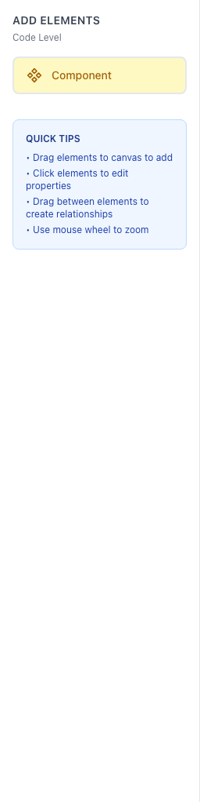

# BAC4 E2E Test Suite

End-to-end tests for the BAC4 Modelling Tool using Playwright.

## Quick Start

```bash
# Install dependencies
npm install

# Run all tests
npm test

# Run tests with UI
npm run test:ui

# Run specific test file
npx playwright test tests/smoke/smoke.spec.ts
```

## How-To Guide

This visual guide shows the main features of BAC4 and how to use them.

### Application Overview

When you first open BAC4, you'll see an empty canvas with the header, toolbar, and canvas controls:


### Header Bar

The header contains the model title, C4 level selector, and action menus:


**Features:**
- **Title**: Double-click to edit the model name
- **Level Selector**: Switch between Context, Container, Component, and Code views
- **Export Menu**: Export to JSON, Structurizr, PlantUML, Mermaid, PNG, or SVG
- **Import Button**: Load existing models
- **Layout Menu**: Auto-arrange elements using various algorithms

### Toolbar - Adding Elements

The toolbar on the left shows available element types based on the current C4 level:

**Context Level:**


**Container Level:**


**Component Level:**


**Code Level:**


**To add an element:**
1. Select the appropriate C4 level
2. Drag an element from the toolbar onto the canvas
3. The element appears with a default name

### Element Types

BAC4 supports all C4 element types with distinct visual styling:

**Software System** (Blue):


**Person** (Purple):


**External System** (Gray):


**Container** (Green):


**Component** (Yellow):


### Selecting Elements

Click on any element to select it. Selected elements show a highlight ring:


### Properties Panel

When an element is selected, the properties panel opens on the right:


**Editable Properties:**
- **Name**: The display name of the element
- **Description**: Detailed description of the element's purpose
- **Technology**: Technical stack (e.g., "React, Node.js")
- **Tags**: Comma-separated tags for categorization

### Creating Relationships

To connect two elements:
1. Hover over an element to see the connection handles
2. Drag from a source handle to a target handle
3. The edge appears with a default "New relationship" label

Edges display with directional arrows:


### Canvas Controls

The canvas includes built-in navigation controls:


**Controls:**
- **Zoom In/Out**: Use mouse wheel or the +/- buttons
- **Fit View**: Center and fit all elements in view
- **MiniMap**: Overview navigation in the bottom right

### Export Options

Click the Export dropdown to see all available formats:


**Export Formats:**
- **JSON**: Native BAC4 format for saving/loading
- **Structurizr JSON**: Compatible with Structurizr DSL
- **PlantUML**: Text-based diagrams
- **Mermaid**: Mermaid diagram syntax
- **PNG/SVG**: Image exports for documentation

### Auto Layout

Use the Layout menu to automatically arrange elements:


**Layout Options:**
- **Hierarchical**: Top-to-bottom tree structure
- **Force-Directed**: Physics-based spring layout
- **Circular**: Elements arranged in a circle
- **Grid**: Aligned grid arrangement

### Example Diagram

A complete context diagram with multiple elements and relationships:


## Test Structure

```
e2e/
├── tests/
│   ├── smoke/              # Basic app loading tests
│   ├── header/             # Title, level selector, menus
│   ├── toolbar/            # Element visibility, drag-drop
│   ├── canvas/             # Pan, zoom, node/edge interactions
│   ├── properties-panel/   # Element and relationship editing
│   ├── persistence/        # localStorage save/restore
│   ├── accessibility/      # axe-core audits, keyboard nav
│   ├── visual/             # Visual regression screenshots
│   └── integration/        # Full workflow tests
├── pages/                  # Page Object Models
├── helpers/                # Test utilities
├── fixtures/               # Test data (models)
└── docs/                   # Documentation and screenshots
```

## Running Tests

```bash
# Run all tests
npm test

# Run with UI mode
npm run test:ui

# Run specific category
npx playwright test tests/smoke/
npx playwright test tests/accessibility/

# Update visual snapshots
npx playwright test --update-snapshots

# Generate HTML report
npx playwright show-report
```

## Test Results

Current test coverage: **163 tests** across:
- Smoke tests
- Header functionality
- Toolbar interactions
- Canvas operations
- Properties panel editing
- Persistence (localStorage)
- Accessibility (WCAG compliance)
- Visual regression
- Integration workflows

## CI/CD

Tests run automatically via GitHub Actions on push and pull requests. See `.github/workflows/e2e-tests.yml`.
